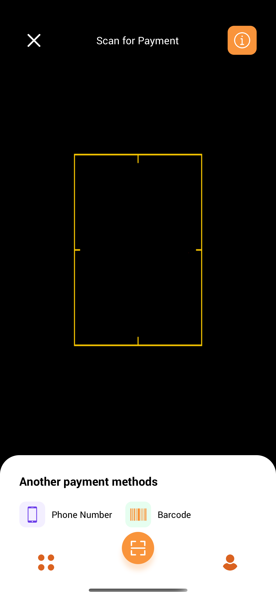

<!-- PROJECT LOGO -->
 

  
  <h3 align="center">Smart Digital Wallet</h3>

## 🆕 Getting Started

- ### **Prerequisites**

  - [React Native](https://reactnative.dev/)
  - [Expo](https://expo.dev/)
  - [Firebase](https://firebase.google.com/)

<!-- GETTING STARTED -->

- ### **Installation**

  First, make sure you have Expo CLI installed: `npm install -g expo-cli`

  Install: `yarn` or `yarn install`!

  Run Project Locally: `yarn dev` or `yarn start`

<!-- SCREENSHORTS -->

## 🔥 Screenshots

  
  
  

## 🌟 Show your support

Give a ⭐️ if this project inspires you!

## 📝 License

Copyright © 2022

<!-- CONTACT -->

## 👤 Contact

| **SR JOY**                                          |
| --------------------------------------------------- |
| - Facebook: [@srjoy01](https://facebook.com/srj101) |
